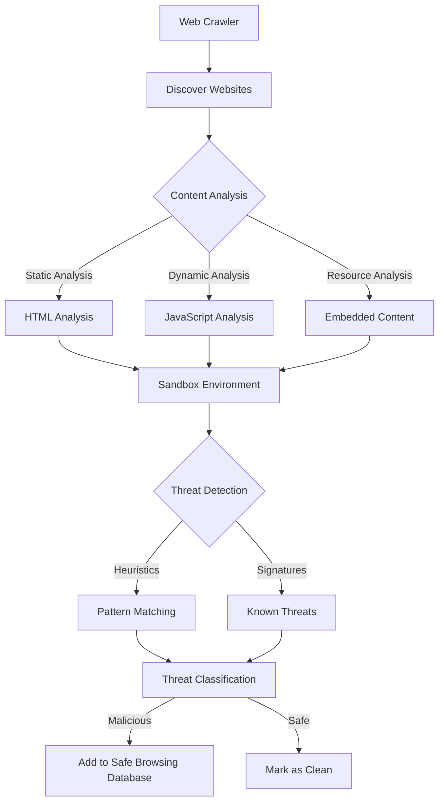
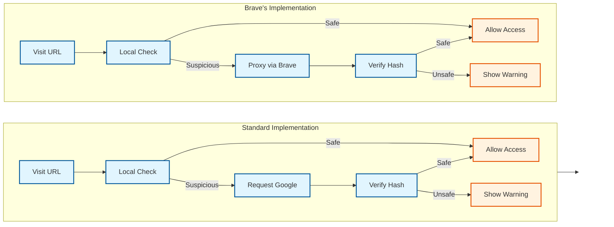
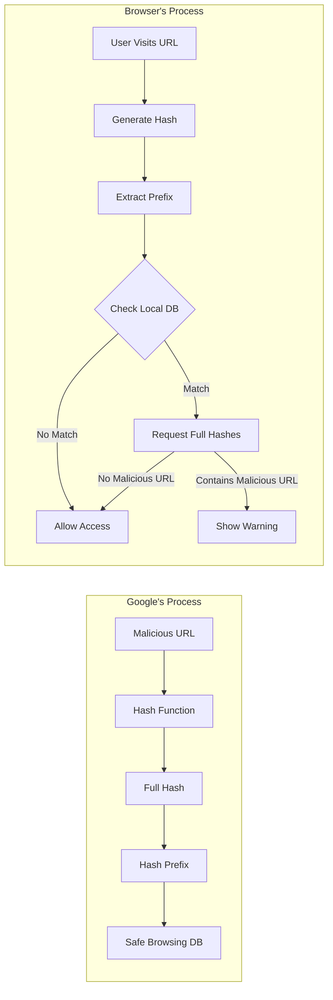

Imagine clicking a link and unwittingly downloading malware that encrypts all your files, or entering your banking credentials on what appears to be your bank's website—only to discover it's an elaborate fake. These aren't hypothetical scenarios; they're daily realities. Enter Google Safe Browsing, our guardian that silently protects billions of users from these exact threats.

In this deep dive, we'll peel back the layers of Google Safe Browsing's technical architecture, explore its critical role in modern web security, and examine how browsers like Brave have innovated upon its foundation to enhance user privacy. Whether you're a developer integrating these protections, a website owner ensuring your site stays secure, or simply someone who wants to understand what keeps you safe online, this guide will equip you with essential knowledge about one of the web's most crucial security systems.

## What is Google Safe Browsing?

[Google Safe Browsing](https://safebrowsing.google.com/) is a security service that identifies unsafe websites across the web and warns users when they attempt to navigate to dangerous sites or download harmful files. Integrated into major web browsers such as Google Chrome, Mozilla Firefox, Apple Safari, and Brave, it serves as a crucial defense against online threats.

## How Does Google Safe Browsing Work?

### 1. Continuous Web Crawling and Analysis

Google employs automated systems called web crawlers to systematically browse the internet.

- **Content Examination**: Crawlers analyze website content, including HTML, JavaScript, and embedded resources.
- **Behavioral Analysis**: Scripts and code are executed in a sandbox environment to detect malicious behaviors not apparent through static analysis.
- **Detection Techniques**: Uses heuristics and signature-based detection to identify malware and phishing sites.

*Flowchart illustrating the web crawling and analysis process.*

### 2. Threat Classification

Identified threats are classified into:

- **Malware Sites**: Distribute harmful software.
- **Phishing Sites**: Imitate legitimate sites to steal sensitive information.
- **Unwanted Software**: Promote software that alters system settings without consent.

### 3. Database Updates and Management

Unsafe URLs are added to Google's Safe Browsing databases.

- **URL Hashing**: URLs are hashed using cryptographic functions to create unique identifiers while preserving privacy.
- **Incremental Updates**: Browsers periodically download updates containing hashed prefixes of unsafe URLs for efficient local checks.

### 4. Real-Time Protection in Browsers

When a user navigates to a website:

- **Local Check**: The browser hashes the URL and compares the prefix against the local Safe Browsing list.
- **Verification Request**: If there's a match, the browser requests full hashes from Google's servers to verify if the URL is malicious.
- **User Warning**: The browser displays a warning if the site is confirmed harmful.

### 5. Privacy Considerations

Google Safe Browsing is designed with privacy in mind:

- **Anonymized Requests**: Verification requests do not include personal information or the actual URL.
- **Limited Data Sharing**: Only hashed prefixes are shared, and requests may include multiple hashes to obfuscate which one triggered the request.

## Why is Google Safe Browsing Important?

### Protecting Users

- **Prevents Malware Infections**: Blocks access to sites distributing harmful software.
- **Guards Against Phishing**: Warns users before they enter information on fraudulent sites.
- **Enhances Confidence**: Users can browse safely knowing they're protected.

### Supporting Website Owners

- **Maintains Reputation**: Helps prevent legitimate sites from being flagged due to compromise.
- **Encourages Best Practices**: Incentivizes robust security measures to avoid being listed.
- **Provides Recovery Tools**: Offers resources to identify and fix security issues.

## Browser Implementations: The Case of Brave

[Brave](https://brave.com/) is a privacy-focused browser that utilizes Google Safe Browsing while enhancing user privacy through specific implementations.

### How Brave Uses Google Safe Browsing

Brave enhances privacy in its implementation of Google Safe Browsing by taking additional steps to protect user data.

#### Proxying Safe Browsing Requests

When Brave needs to request full hashes from Google's Safe Browsing servers (after a local match of a hashed prefix), it routes these requests through Brave's servers.

- **Anonymity**: This prevents Google from seeing the user's IP address, enhancing privacy.
- **Privacy Enhancement**: Stops Google from associating Safe Browsing requests with specific users.

#### Limiting Data Sent to Google

Brave minimizes the data sent to Google by:

- **Not Including Identifiers**: Excludes any identifying information from Safe Browsing requests.
- **Batching Requests**: Groups multiple requests to further obscure individual user activity.

#### Local Checks with Frequent Updates

- **Regular Updates**: Brave frequently updates the local Safe Browsing lists to ensure up-to-date protection.
- **Efficiency**: Local checks are fast and protect user privacy by avoiding unnecessary network requests.

*Flowchart comparing standard Safe Browsing implementation with Brave's enhanced privacy approach.*

## Responding to Google Safe Browsing Warnings

### For Users

- **Heed Warnings**: Avoid visiting sites flagged as unsafe.
- **Report Issues**: If you believe a site is mistakenly flagged, report it through the [Google Transparency Report](https://transparencyreport.google.com/safe-browsing/search?hl=en).

### For Website Owners

1. **Identify the Issue**: Use [Google Search Console](https://search.google.com/search-console/about) to find out why your site was flagged.
2. **Clean Your Site**: Remove malicious code, infected files, or unauthorized content.
3. **Secure Your Site**: Fix vulnerabilities, update passwords, and check user permissions.
4. **Request a Review**: After ensuring your site is clean, request a review via Search Console.
5. **Monitor Regularly**: Keep an eye on your site's security status to prevent future issues.

## The Technical Details Behind Safe Browsing

### URL Hashing and Privacy

- **Hash Functions**: Convert URLs into fixed-size strings (hashes) using functions like SHA256.
- **Hash Prefixes**: Only a portion of the hash is used for local checks, enhancing privacy.
- **Privacy Preservation**: Reduces the chance of exposing browsing history to Google.

[Learn more about hash-based Safe Browsing in this Google Security Blog post.](https://security.googleblog.com/2022/08/how-hash-based-safe-browsing-works-in.html)

*Diagram showing the process of URL hashing and how hash prefixes are used to check against the Safe Browsing database without compromising privacy.*

### Machine Learning and Threat Detection

- **Pattern Recognition**: Analyzes vast amounts of data to identify patterns indicative of malicious sites.
- **Adaptive Algorithms**: Continuously improves to detect new and sophisticated threats.

### Collaboration and Data Sharing

- **Industry Partnerships**: Shares threat intelligence with other organizations to enhance overall internet security.
- **User Reports**: Feedback from users and website owners helps improve detection accuracy.

## The Impact of Google Safe Browsing

- **Reduces Malware Spread**: Blocks access to harmful sites, limiting malware distribution.
- **Lowers Phishing Success**: Protects users from deceptive sites, reducing phishing incidents.
- **Promotes Security Standards**: Encourages best practices globally, improving overall web security.

## Conclusion

Google Safe Browsing is an elegant balance of robust security and technical sophistication helps create a safer internet for everyone – from casual browsers to business owners. While the technology itself is remarkable, it's the innovations by privacy-focused browsers like **Brave** that truly showcase its potential: proving that - we don't have to choose between staying safe and staying private. The future of web security isn't just about building walls; it's about building them intelligently.

---
*Do you have any experiences or tips related to staying safe online? Share your thoughts!*
